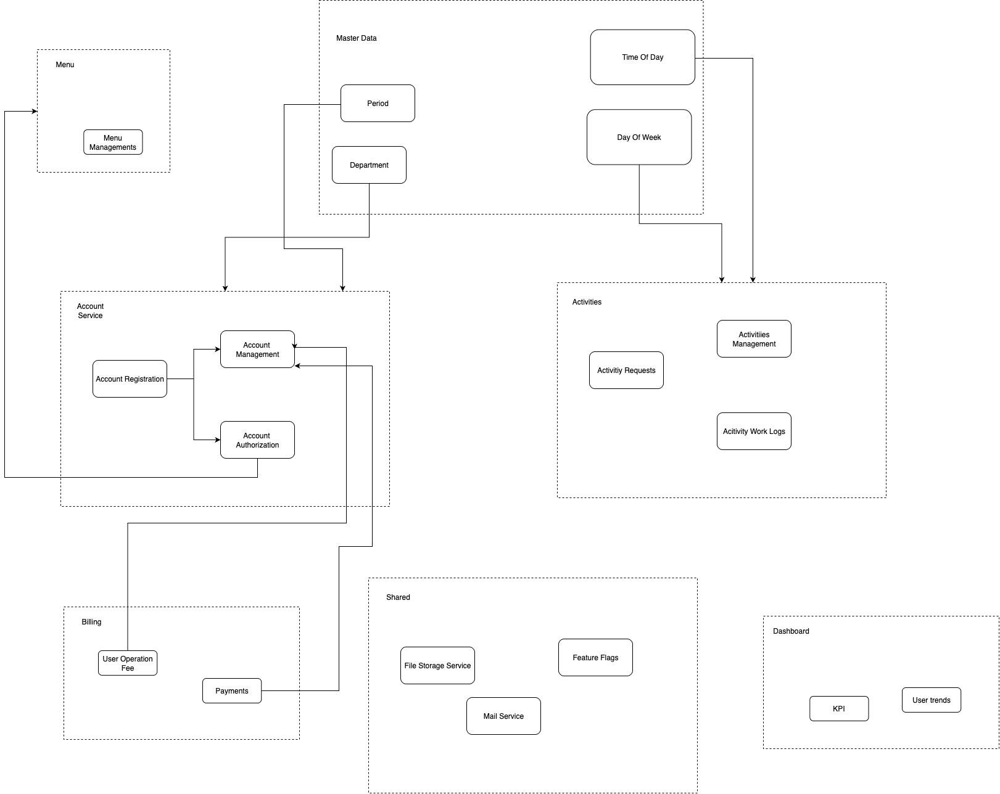

# 🧑‍💼 User Management Backend API

A backend service for managing user accounts, access control, and related billing and activity tracking in a Domain-Driven Design (DDD) architecture. This service is built with [NestJS](https://nestjs.com/) and uses `pnpm` as the package manager.

## 📦 Tech Stack

- **Framework**: [NestJS](https://nestjs.com/)
- **Language**: TypeScript
- **Package Manager**: [pnpm](https://pnpm.io/)
- **Architecture**: Domain-Driven Design (DDD)
- **Database**: PostgreSQL
- **ORM**: Prisma (optional if applicable)
- **Mail Service**: Resend (for notifications)
- **Shared Utilities**: Feature flags, file storage, mail service

---

## 🗂️ Domain Overview

The application is organized into modules that follow DDD boundaries. Here's a breakdown:

### 🔐 Account Service
- `Account Registration`: Handles user sign-up
- `Account Authorization`: Role-based access control
- `Account Management`: Profile and status updates

### 🧾 Billing
- `User Operation Fee`: Handles monthly user fee logic
- `Payments`: Tracks transaction history and debt status

### 📋 Activities
- `Activity Requests`: Submit and track activity approvals
- `Work Logs`: Logs user attendance or task tracking

### 📊 Dashboard
- `KPI` & `User Trends`: Metrics & performance insights

### 🛠 Shared Services
- `File Storage`, `Mail Service`, `Feature Flags`

### 📚 Master Data
- Periods, Departments, Time of Day, Day of Week

> 💡 See `docs/` or the diagram for full service interaction.



---

## 🚀 Getting Started

### 📥 Prerequisites

- [Node.js](https://nodejs.org/) v18+
- [pnpm](https://pnpm.io/) (install via `npm i -g pnpm`)
- [PostgreSQL](https://www.postgresql.org/) database

### 🔧 Install Dependencies

```bash
pnpm install
```
And run it
```bash
pnpm run dev
```
Trigger upload work logs
```bash
pnpm run upload
```